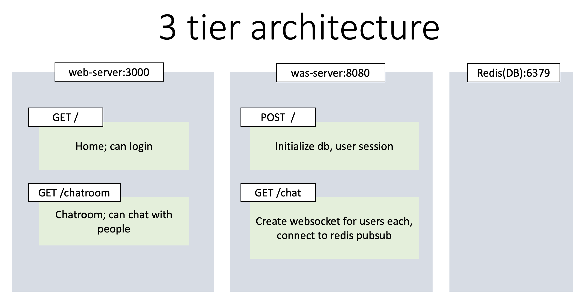
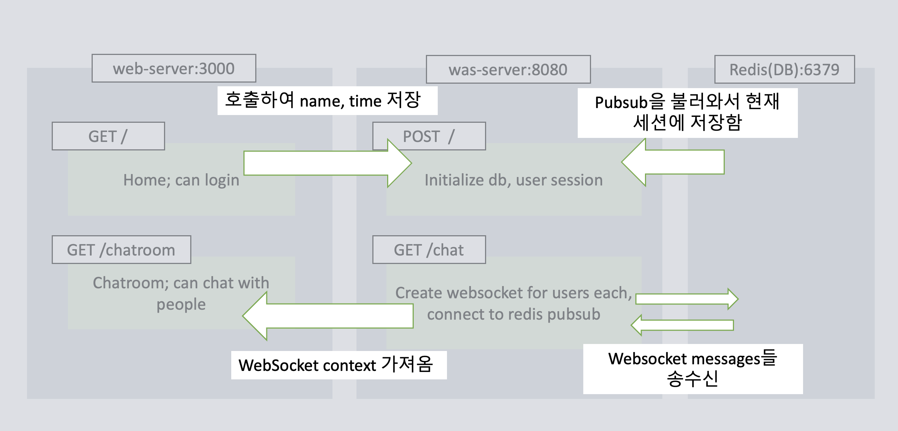
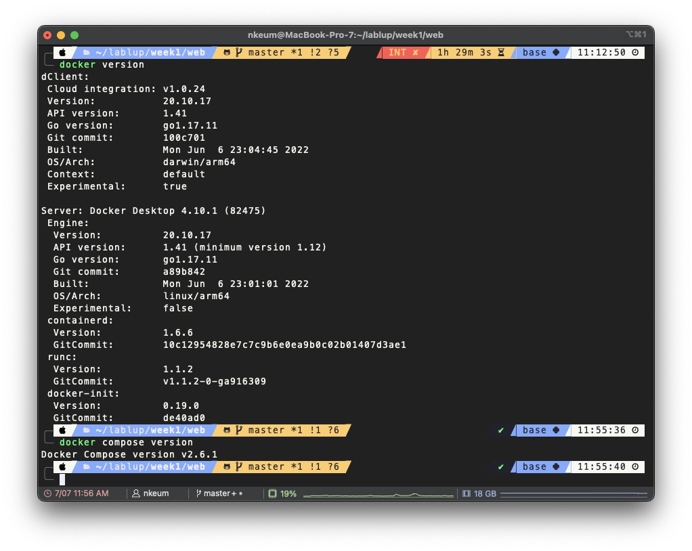

# Multi-user Single-room chatting

### `#aiohttp`, `#redis-py`, `#asyncio`, `#React.ts`

## Made by [금나연](https://github.com/NayeonKeum) [nkeum@lablup.com](nkeum@lablup.com)

## Features

- Can chat with multiple users in a single chatroom
  

  

  

## Execute

## How to execute

### Check conditions

- `docker`, `docker-compose` should be installed
  

### 1. For **Use-only**

**1) Use current docker-compose.yml file**

- There is two kinds of docker-compose.yml files in `./docker-composes` directory
  - `docker-compose-prod.yml(default)`: for use-only(uses dockerhub images)
  - `docker-compose-dev.yml`: for develop(uses local diretories to build images)

**2) Execute with docker compose**

```bash
docker compose build && docker compose up
```

### 2.For **Local Develop**

Recommended to freely upgrade this(add features, report bugs, ...) :smile:!

**1) Use current docker-compose.yml file**

- There is two kinds of docker-compose.yml files in `./docker-composes` directory
  - `docker-compose-prod.yml(default)`: for use-only(uses dockerhub images)
  - `docker-compose-dev.yml`: for develop(uses local diretories to build images)
- Use `docker-compose-dev.yml` in this case.

**2) Execute with docker compose**

```bash
docker compose build && docker compose up
```

**3) Info**

- There is a Docker CI for web, was server each made by github actions.
- Checkout `./.github/workflows/was-image-build.yml` and `./.github/workflows/web-image-build.yml`
  - `./WEB/` for web-frontend(React.ts)
  - `./WAS/` for backend-server(Python-aiohttp)

### 2. For **Local Execution**

**1) Execute DB(Redis) with Docker**

```bash
docker run -p 6379:6379 -it redis/redis-stack:latest
```

**2) Execute WAS with python3**

- If wanting to execute locally, please check `pythonv3.11`(and other requirements in `./WAS/requirements.txt`) (I'm using pyenv).
- And, since was is not a docker container, it can't use docker dns for redis(redis://redis:6379) and should use localhost(port-forwarded).

```bash
export REDIS_ADDR="redis://localhost:6379" # Code uses env var
python3 WAS/server.py
```

- WAS server will use http://localhost:8080/

**3) Execute WEB with npm**

- `npm v9.6.6`, `yarn v1.22.19`, `node v19.8.1`.

```bash
cd WEB
npm install
npm start
```

- WEB server will use http://localhost:3000/

## ETC

### Error log🐞...

- [Onboarding Error log🐞](https://proud-passbook-808.notion.site/Onboarding-Error-log-ceebbf16752c4fb59877327a954633fe?pvs=4)
